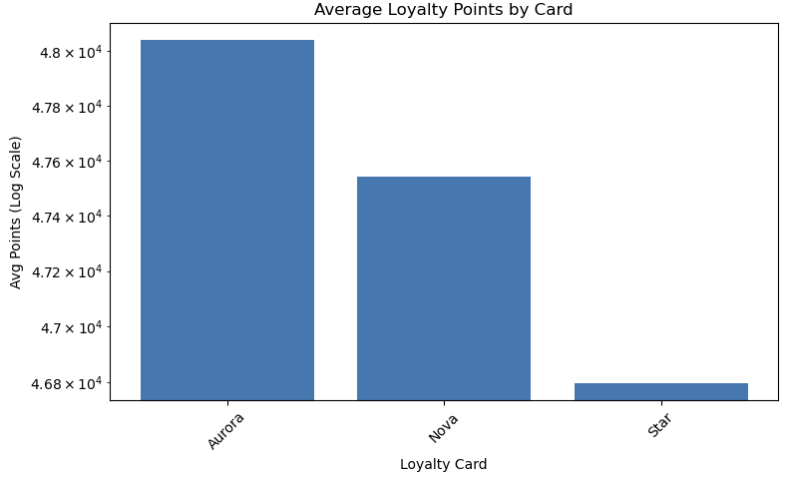
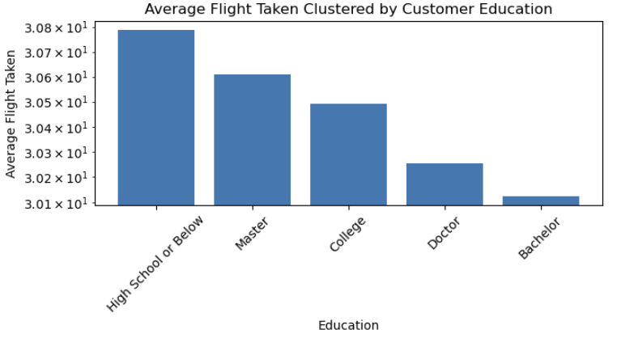
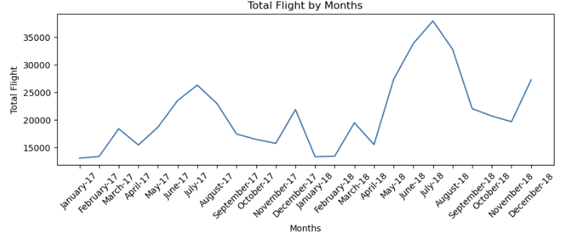

# Data Analytics with PySpark


This repository includes the following steps:  
1. Preparation  
2. Extracting CSV files to PySpark DataFrames  
3. Data Cleaning with PySpark DataFrames  
4. Data Transformation  
5. Analytics with SQL and Data Visualization  
6. Result Saving  

---

## 1. Preparation

### A. Setup

1. Clone this repo
2. Build and run the Docker containers:
   ```bash
   docker compose --profile spark up -d --build
   ```
3. Open JupyterLab at [http://localhost:8888/lab/](http://localhost:8888/lab/)

### B. Prepare Libraries and Data

1. Required libraries:
   ```python
   import os
   import pandas as pd
   import matplotlib.pyplot as plt
   from pyspark.sql.functions import concat, lpad, col, year, month, lit
   from pyspark.sql import SparkSession
   from pyspark import SparkContext, SparkConf
   from datetime import date
   ```

2. If `gdown` is not installed:
   ```python
   !pip install gdown
   ```

3. Download the dataset using:
   ```bash
   !gdown https://drive.google.com/uc?id=1Ahz9hadZC5L1gE3bt7b-1G0LZH49t1Zb
   !gdown https://drive.google.com/uc?id=1830nV_EOTITx7YeDjMu_ys8XqMWtGsDQ
   !gdown https://drive.google.com/uc?id=1_KuITS4wf6uMv9ytr8FyhPg789BpgAay
   ```

### C. Start a Spark Session

Use all available cores:
```python
spark = SparkSession.builder.master("local[*]") \
                    .appName('analytics1') \
                    .getOrCreate()
```

---

## 2. Extract CSV Files into PySpark

Use the following to load each CSV:
```python
spark.read.option("header", True).csv(f"{name}.csv")
```
This reads the CSV with headers.

---

## 3. Data Cleaning with PySpark DataFrames

1. Remove duplicates:
   ```python
   df.dropDuplicates()
   ```

2. Remove rows with nulls (if necessary):
   ```python
   df.dropna()
   ```

---

## 4. Data Transformation

1. Disable adaptive query execution for predictable behavior:
   ```python
   spark.conf.set("spark.sql.adaptive.enabled", "false")
   ```

2. Register a temporary view for SQL querying:
   ```python
   customer_activity_df.createOrReplaceTempView("customer_activity")
   ```

3. Example SQL transformation:
   ```python
   spark.sql("""
       SELECT loyalty_number, SUM(points_accumulated) AS total_points, SUM(total_flights) AS total_flights_taken
       FROM customer_activity
       GROUP BY loyalty_number
       ORDER BY total_points DESC
   """)
   ```

4. Disable sort-merge join and broadcast join to avoid unexpected performance optimizations:
   ```python
   spark.conf.set("spark.sql.join.preferSortMergeJoin", "false")
   spark.conf.set("spark.sql.autoBroadcastJoinThreshold", -1)
   ```

5. Join two tables:
   ```python
   customer_df.select(...)
       .join(other_table, "loyalty_number")
   ```

---

## 5. SQL Analytics & Data Visualization

### A. What is the average number of flights per customer?

```python
spark.sql("""
    SELECT CAST(AVG(total) AS DECIMAL(10,3)) AS average_total_flight_each_customer
    FROM (
        SELECT loyalty_number, SUM(total_flights) AS total
        FROM customer_activity
        GROUP BY loyalty_number
    )
""").show()
```
>  Result: On average, each customer takes about 30.268 flights.

---

### B. Loyalty Points Distribution by Loyalty Card

1. Join customer activity and loyalty data.
2. Aggregate `points_accumulated` per loyalty card type.
3. Visualize using matplotlib:
```python
df = loyalty_card_point_dist.toPandas()
df = df[df['average_total_loyalty_points'] > 0]
plt.figure(figsize=(8, 5))
plt.bar(df['loyalty_card'], df['average_total_loyalty_points'])
plt.title("Average Loyalty Points by Card")
plt.yscale("log")
plt.xticks(rotation=45)
plt.xlabel("Loyalty Card")
plt.ylabel("Avg Points (Log Scale)")
plt.tight_layout()
plt.savefig("visual_result_image/img_loyalty_card_point_dist.png")
plt.show()
```

>  Aurora card users accumulate the highest average loyalty points (≈ 48,039), followed closely by Nova and Star.

---

### C. Correlation Between Education and Total Flights

```python
spark.sql("""
    SELECT education, CAST(AVG(total_flights_taken) AS DECIMAL(10,3)) AS average_total_flights_taken
    FROM join_table1
    GROUP BY education
    ORDER BY average_total_flights_taken DESC
""").show()
```

>  There's no strong correlation between education level and total flights taken.

---

### D. Flight Trends Over Time

1. Create `month_year` column:
```python
customer_activity_df = customer_activity_df.withColumn(
    "month_year", concat(lpad(col("month").cast("string"), 2, "0"), lit("-"), col("year").cast("string"))
)
```

2. Join with `calendar_df` using `month_year`, then:
```python
merged_df2.createOrReplaceTempView("join_table2")
flights_trend = spark.sql("""
    SELECT date_format(start_of_the_month,'MMMM-yy') AS month_label,
           SUM(total_flights) AS total_flights_taken
    FROM join_table2
    GROUP BY start_of_the_month
    ORDER BY start_of_the_month ASC
""")
```

>  Peak flight activity is in July, while January sees the lowest.

---

## 6. Result Saving

1. Create folders:
```python
os.makedirs("visual_result_image", exist_ok=True)
os.makedirs("join_table_result_file", exist_ok=True)
os.makedirs("query_table_result_file", exist_ok=True)
```

2. Save visualizations:
```python
plt.savefig("visual_result_image/img_loyalty_card_point_dist.png")
```

3. Save Spark DataFrames:
```python
merged_df1.write.csv("join_table_result_file/merged_df1.csv", header=True, mode='overwrite')
```

4. Save pandas DataFrames:
```python
loyalty_card_point_dist_pd.to_csv("query_table_result_file/loyalty_card_point_dist.csv", index=False)
```

---
Feel free to explore the notebook and adapt the code for your own analytics workflows. Contributions and feedback are welcome!#
